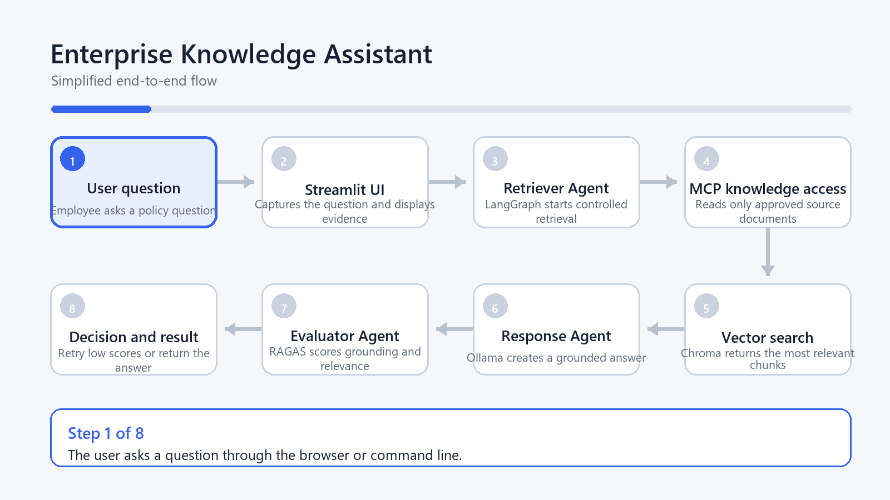
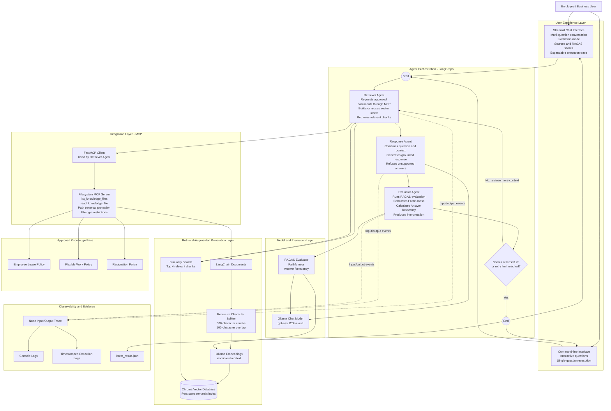
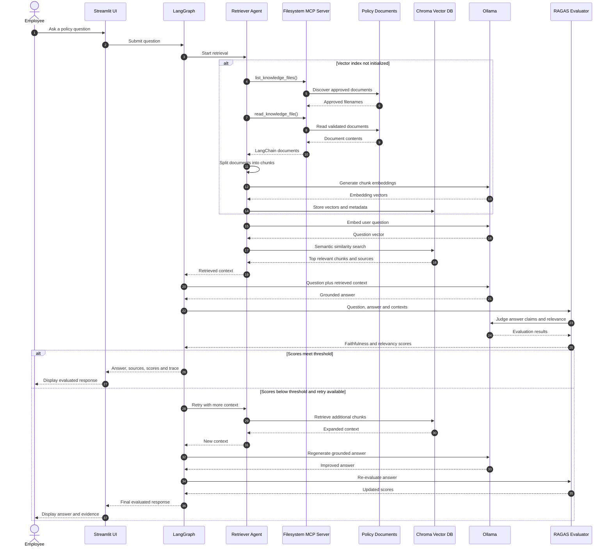
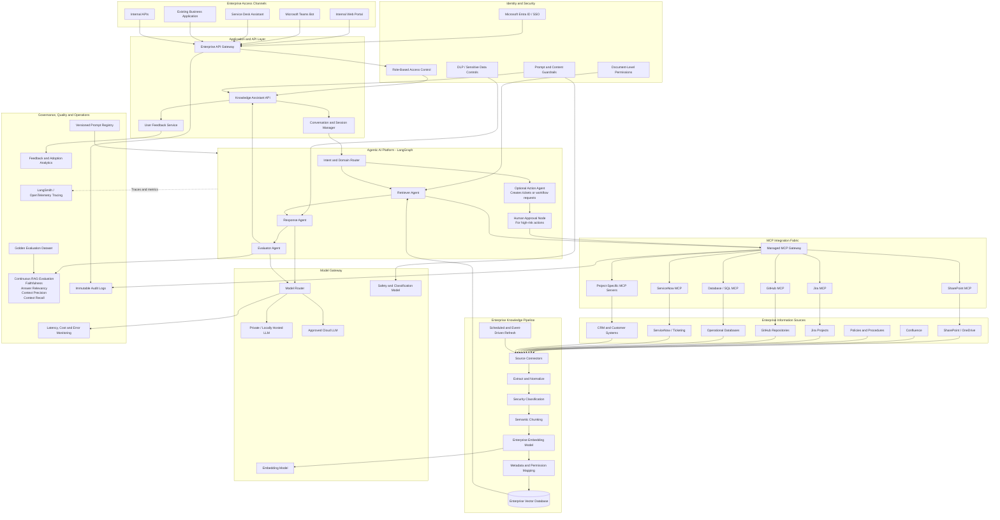

# Enterprise Knowledge Assistant Architecture

This document describes the current proof-of-concept architecture and a
production-ready evolution suitable for an internal enterprise platform.

## Start here: simplified animated flow

The animation below highlights one stage at a time and is intended for project
demonstrations and manager presentations.

The remaining diagrams provide deeper technical detail for engineering and
architecture discussions.

## 1. Current solution architecture

## 2. Request execution sequence

## 3. Current component responsibilities

| Component | Responsibility |
|---|---|
| Streamlit UI | Provides chat history, execution mode selection, answers, sources, scores, interpretation and trace details |
| Command-line interface | Supports interactive terminal questions and automated single-question execution |
| LangGraph | Controls the agent workflow, state transitions and conditional retry |
| Retriever Agent | Loads approved documents through MCP, builds the index and retrieves relevant context |
| Response Agent | Generates concise answers using only retrieved context |
| Evaluator Agent | Runs mandatory RAGAS metrics and interprets the results |
| FastMCP Server | Provides controlled access to approved knowledge files |
| RAG service | Performs chunking, embedding, vector storage and similarity retrieval |
| Chroma | Stores document vectors and source metadata |
| Ollama | Supplies the generation and embedding models |
| RAGAS | Measures Faithfulness and Answer Relevancy |
| Observability | Records node inputs, node outputs, routing decisions and final results |

## 4. Production-ready enterprise architecture

## 5. Enterprise architecture layers

| Layer | Purpose | Business value |
|---|---|---|
| Experience | Web, Teams, APIs and existing applications | Users access knowledge from tools they already use |
| Identity and security | SSO, roles, document permissions and DLP | Users only receive information they are permitted to see |
| Agent orchestration | Coordinates retrieval, generation, evaluation and actions | Produces controlled, auditable agent behaviour |
| MCP integration | Provides a standard interface to enterprise systems | New sources and actions can be added without redesigning the agent |
| Knowledge pipeline | Ingests, chunks, embeds and indexes enterprise content | Converts disconnected content into searchable organizational knowledge |
| Model gateway | Selects an approved local or cloud model | Controls data residency, cost and model flexibility |
| Evaluation | Measures answer grounding and relevance | Reduces hallucination risk and provides measurable quality |
| Observability | Captures traces, feedback, latency, failures and cost | Enables support, compliance and continual improvement |

## 6. Recommended business use cases

### Project knowledge assistant

Search architecture documents, coding standards, release procedures, project
decisions and operational instructions.

### Production-support assistant

Retrieve runbooks, known-error articles, previous incidents and troubleshooting
steps to reduce diagnosis time.

### Employee policy assistant

Answer questions about HR policies, leave, travel, compliance and internal
procedures.

### Service desk copilot

Suggest resolutions from historical tickets and create a support ticket when
human assistance is required.

### Developer onboarding assistant

Explain repository structure, local setup, coding standards, deployment
processes, team responsibilities and service ownership.

### Audit and compliance assistant

Retrieve approved procedures with exact sources and record the supporting
evidence used for every response.

## 7. Manager-level value proposition

The solution provides a governed conversational layer over fragmented
enterprise knowledge. Unlike a basic chatbot, it retrieves approved evidence,
generates a grounded response, measures response quality, records the execution
path and can securely connect to enterprise systems through MCP.

Key differentiators:

- Answers include evidence and source documents.
- RAGAS provides measurable quality instead of relying only on user perception.
- LangGraph makes the workflow controlled, observable and extensible.
- MCP provides a reusable integration standard.
- The model can remain local or be routed to an approved cloud provider.
- The same architecture can progress from answering questions to performing
  approved business actions.

## 8. Suggested implementation roadmap

### Phase 1 - Focused proof of value

- Select one high-value, low-risk project knowledge domain.
- Connect a limited set of approved documents.
- Define 30-50 representative questions and expected answers.
- Measure answer quality, response time and user satisfaction.
- Keep the assistant read-only.

### Phase 2 - Controlled pilot

- Add enterprise authentication and role-based access.
- Integrate SharePoint, Confluence, Jira or the relevant project repository.
- Introduce document-level permission filtering.
- Add feedback collection and operational dashboards.
- Establish content ownership and refresh schedules.

### Phase 3 - Production platform

- Deploy behind the enterprise API gateway.
- Add centralized model routing, audit logs and DLP controls.
- Establish golden evaluation datasets and release quality gates.
- Add high availability, monitoring and support processes.
- Expand to additional business domains.

### Phase 4 - Governed actions

- Add action agents for approved workflows such as ticket creation.
- Require human approval for sensitive or high-impact operations.
- Apply least-privilege MCP permissions.
- Audit every action, input, approval and external-system response.

## 9. Success measures

Recommended pilot measures include:

- Percentage of questions answered with sufficient evidence.
- Faithfulness and Answer Relevancy scores.
- Reduction in time spent searching for information.
- Reduction in repeated service desk or subject-matter-expert questions.
- User satisfaction and answer acceptance rate.
- Number of unanswered questions caused by missing content.
- Response latency and model operating cost.
- Security, permission and audit exceptions.

## 10. Key production considerations

- Enforce the source system's access permissions during retrieval.
- Treat retrieved content as untrusted and protect against prompt injection.
- Avoid placing secrets, credentials or sensitive personal data in prompts.
- Maintain document ownership, versioning and refresh processes.
- Log source references, model versions, prompts, scores and routing decisions.
- Use human approval before the assistant changes enterprise data.
- Maintain an evaluation dataset representing real project questions.
- Review model and embedding changes through measured quality gates.
